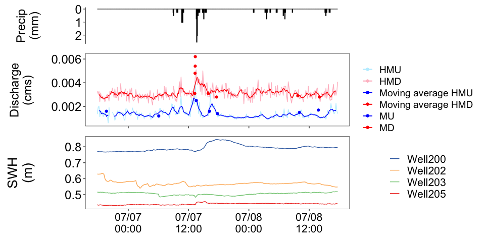
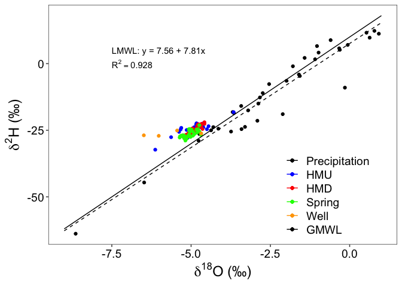

```
## Parsed with column specification:
## cols(
##   Date = col_character(),
##   Well200 = col_double(),
##   Well202 = col_double(),
##   Well203 = col_double(),
##   Well205 = col_double()
## )
```


# Hydrograph, Hyetograph, Stable Water Isotope Time Series

<!-- -->

# Groundwater Standing Water Height Time Series

<!-- -->

# Stable water isotope bivariate plot with GMWL


```
## `geom_smooth()` using formula 'y ~ x'
```

<!-- -->

# Piper Diagram of Streamwater and Endmembers


# Gibbs Diagram


# Time Series of Base Cations Over 48 Hours


# Time Series of Trace Elements Over 48 Hours


# Time Series of Carbon and Nitrogen Species Over 48 Hours


# ICPMS Time Series 

<!-- -->

# Mass Loads Over 48 Hours: Trace Elements
<!-- -->


# Pair Plots 

<details>
<summary> Pair plot for Base Cations </summary>
<br>

```
## <seaborn.axisgrid.PairGrid object at 0x7fe7807f6e90>
```


</details>

<details>
<summary> Pair plot for Select Trace Elements </summary>
<br>

```
## <seaborn.axisgrid.PairGrid object at 0x7fe77051cf50>
```


</details>

<details>
<summary> Pair plot for Select Isotopes </summary>
<br>

```
## <seaborn.axisgrid.PairGrid object at 0x7fe7a22f1e10>
```


</details>

<details>
<summary> Pair plot for ICPMS vs. IC </summary>
<br>

```
## <seaborn.axisgrid.PairGrid object at 0x7fe780b18550>
```


</details>


<details>
<summary> Pair plot for Nitrogen Species and Stable Water Isotopes </summary>
<br>

```
## <seaborn.axisgrid.PairGrid object at 0x7fe7b05f9890>
```


</details>

<!--
<details>
<summary> How do I dropdown </summary>
<br>
This is how you dropdown.
</details>
-->


